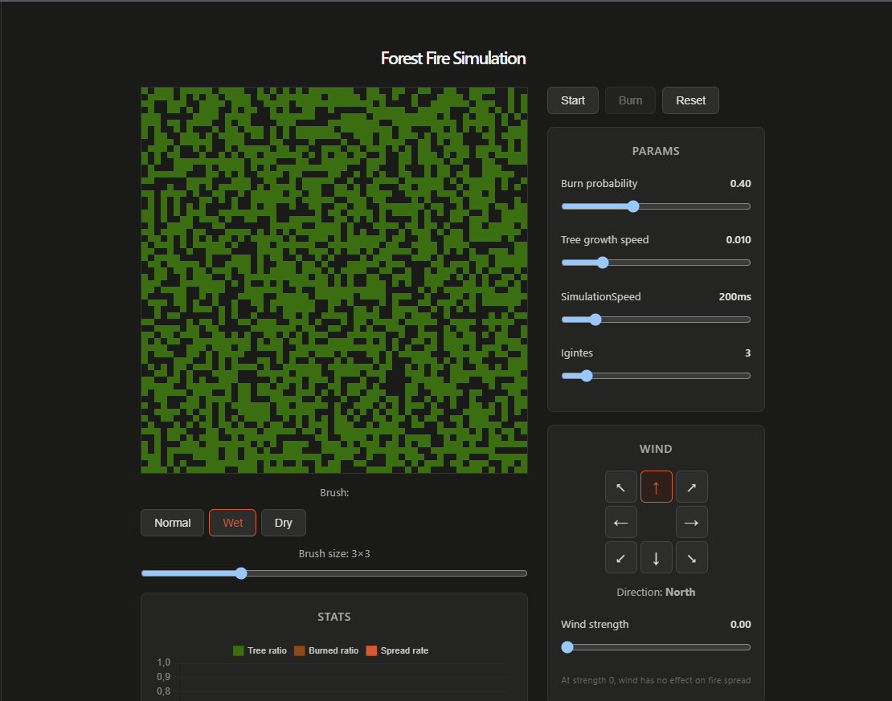
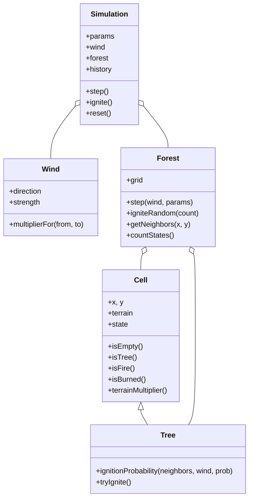

# 🔥 Forest Fire Simulation

Имитационная модель распространения лесного пожара на клеточном автомате. Учебный проект по проектно-технологической практике: React + Vite.
<p align="center">
  
  <br>
</p>

---

## Содержание

- [Идея](#идея)
- [Возможности](#возможности)
- [Математическая модель](#математическая-модель)
- [Архитектура](#архитектура)
- [Установка и запуск](#установка-и-запуск)
- [Управление](#управление)
- [Структура проекта](#структура-проекта)
- [Возможные доработки](#возможные-доработки)

---

## Идея

Лес представлен сеткой 60×60 клеток. Каждая клетка находится в одном из четырёх состояний:

```
EMPTY  →  TREE  →  FIRE  →  BURNED
 (пусто)  (дерево) (огонь) (зола)
```

На каждом шаге симуляции (тике) состояния всех клеток обновляются **синхронно**.

## Возможности

- 🌲 Настраиваемая плотность леса и скорость роста новых деревьев
- 🔥 Ручной поджиг случайных деревьев (кнопка **Burn**) и точечный поджиг кликом по канвасу
- ⚡ Самопроизвольные возгорания («молния») с настраиваемой вероятностью — пожар может начаться и без нажатия кнопки
- 🧭 Ветер: 8 направлений + сила, влияет на вероятность распространения огня в конкретную сторону
- 🎨 Кисть для раскраски местности прямо на канвасе: обычная / влажная / сухая — до старта симуляции
- 📊 Живой график (Chart.js): доля леса, доля выгоревшего, скорость распространения
- ⏸️ Пауза / сброс / регулировка скорости на лету

## Математическая модель

### Окрестность Мура

Соседями клетки `(x, y)` считаются все 8 клеток вокруг неё (включая диагонали):


### Вероятность загорания

Для дерева с несколькими горящими соседями вероятность **не** загореться — это произведение вероятностей не загореться от каждого соседа по отдельности (независимые события):

```
P(загорится) = 1 − ∏ (1 − baseFireProb × windMultiplier(соседа) × terrainMultiplier)
```

- **`baseFireProb`** — базовая вероятность возгорания (слайдер "Burn probability")
- **`terrainMultiplier`** — множитель местности: `NORMAL = 1.0`, `WET = 0.4`, `DRY = 1.6`
- **`windMultiplier`** — зависит от направления ветра относительно направления «от горящего соседа к этому дереву», через косинусное сходство векторов:

```
windMultiplier = 1 + strength × cos(θ)
```

где `θ` — угол между вектором ветра и вектором «сосед → клетка». Если ветер дует **в сторону** распространения огня, `cos(θ) ≈ 1` и множитель растёт; если **против**, множитель падает.

### Самопроизвольное возгорание («молния»)

Дерево без горящих соседей тоже может загореться — с отдельной, обычно очень маленькой вероятностью `lightningProb` за тик. Без этого механизма лес мог бы гореть только по ручному поджигу.

### Случайный поджиг

При нажатии **Burn** выбирается `igniteCount` случайных деревьев по всей сетке — равномерно, через шафл Фишера — Йейтса (честная случайная перестановка, без смещения в какую-либо сторону сетки).

## Архитектура

Пять классов на чистом JS отвечают за модель, пять React-компонентов — за интерфейс.



**React-слой:**

| Компонент | Отвечает за |
|---|---|
| `App.jsx` | Хранит `Simulation` в `useRef`, игровой цикл (`setInterval`), передаёт данные вниз |
| `SimulationCanvas.jsx` | Отрисовка сетки на `<canvas>`, кисть местности, поджиг кликом |
| `ControlPanel.jsx` | Слайдеры параметров (вероятности, скорость, кол-во очагов) |
| `WindControl.jsx` | Компас направления ветра + слайдер силы |
| `StatsChart.jsx` | График Chart.js в реальном времени |


## Управление

1. **До старта** — закрась кистью зоны влажной/сухой местности (по умолчанию кисть выключена во время симуляции)
2. **Start** — запускает игровой цикл
3. **Burn** — поджигает `igniteCount` случайных деревьев (доступно только пока запущено)
4. Клик по канвасу во время симуляции — точечный поджиг конкретного дерева
5. Слайдеры и компас ветра можно крутить прямо во время работы симуляции
6. **Pause** / **Reset** — остановить / начать заново

## Структура проекта

```
forest_fire/
├── src/
│   ├── simulation/          # чистая логика, без React
│   │   ├── Cell.js
│   │   ├── Tree.js
│   │   ├── Wind.js
│   │   ├── Forest.js
│   │   └── Simulation.js
│   ├── components/
│   │   ├── SimulationCanvas.jsx
│   │   ├── ControlPanel.jsx
│   │   ├── WindControl.jsx
│   │   └── StatsChart.jsx
│   ├── App.jsx
│   └── App.css
└── package.json
```


---

<sub>Сделано в рамках проектно-технологической практики.</sub>
